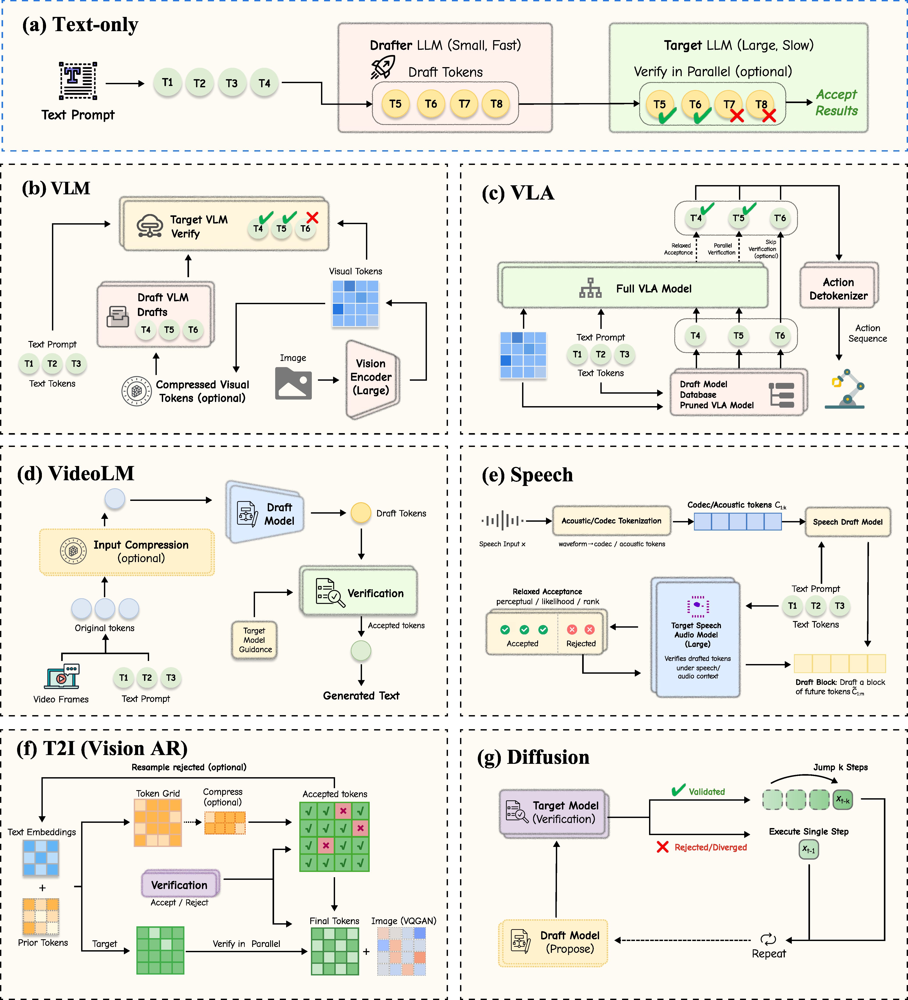

# Speculative Decoding for Multimodal Models: A Survey


<h5 align="center"> If you like our project, please give us a star ⭐ on GitHub for the latest update.</h5>
<h5 align="center">

# Awesome Multimodal Speculative Decoding

A curated list of research papers on **speculative decoding** for multimodal models, including vision‑language systems, autoregressive text‑to‑image generators, video large language models, vision‑language‑action models and point‑cloud synthesis.
 This repository is designed to accompany a survey on speculative decoding techniques and to provide a convenient index for researchers and practitioners.
 All credit for the listed works goes to their original authors.


## ⚡ News

This section will contain important announcements (e.g., new versions of the survey, acceptance notices, or major updates to the repository).
 Stay tuned for future updates!


## 📌 What is this survey about?

Speculative decoding is a technique aimed at reducing the inference latency of autoregressive models by **drafting** multiple candidate tokens (or visual primitives) before verifying them using a more precise model.
 In the *multimodal* setting—where inputs and outputs may include images, text, videos, actions or geometric data—efficient inference is crucial for interactive and real‑time applications.
 This survey organizes existing research on multimodal speculative decoding, highlights emerging trends, and identifies open challenges for future work.
 Readers are encouraged to browse the paper list below to explore current efforts in this fast‑growing area.


<p align="center">
  
</p>

## 📝 Citation

If you find this repository or the accompanying survey useful in your research, please consider citing it.
 A complete BibTeX entry will be provided here once the survey is formally published.
 Below is a placeholder template:

```
@article{author_year_multimodal_speculative,
  title={Speculative Decoding for Multimodal Models: A Survey},
  author={<author names>,
  journal={<journal information>},
  year={<year>}
}
```


## 📖 Table of Contents


  - [Vision-Language Models (Image + Text)](#visionlanguage-models-image--text)

  - [Autoregressive Text-to-Image Generation](#autoregressive-texttoimage-generation)

  - [Video Large Language Models (Video + Text)](#video-large-language-models-video--text)

  - [Vision-Language-Action Models (Image + Text + Action)](#visionlanguageaction-models-image--text--action)

  - [Speech & Audio](#speech--audio)

  - [Diffusion Models](#diffusion-models)

  - [Point Cloud](#point-cloud)


## 📚 Paper List

### Vision‑Language Models (Image + Text)

·    **[ArXiv 2024.04]** On Speculative Decoding for Multimodal Large Language Models [[Paper\]](https://arxiv.org/pdf/2404.08856)

·    **[ICLR 2025 Workshop]** In‑batch Ensemble Drafting: Robust Speculative Decoding for LVLMs [[Paper\]](https://openreview.net/pdf?id=ffDhpmwqdu)

·    **[ArXiv 2025.05]** Speculative Decoding Reimagined for Multimodal Large Language Models [[Paper\]](https://arxiv.org/pdf/2505.14260) [[Code\]](https://github.com/Lyn-Lucy/MSD)

·    **[ArXiv 2025.05]** DREAM: Drafting with Refined Target Features and Entropy‑Adaptive Cross‑Attention Fusion for Multimodal Speculative Decoding [[Paper\]](https://arxiv.org/pdf/2505.19201)

·    **[Findings of EMNLP 2025]** MASSV: Multimodal Adaptation and Self‑Data Distillation for Speculative Decoding of Vision‑Language Models [[Paper\]](https://aclanthology.org/2025.findings-emnlp.656.pdf)

·    **[IEEE/DAC 2025]** AASD: Accelerate Inference by Aligning Speculative Decoding in MLLMs [[Paper\]](https://ieeexplore.ieee.org/stamp/stamp.jsp?tp=&arnumber=11132960)

·    **[ICML 2025 Workshop]** Spec‑LLaVA: Accelerating Vision‑Language Models with Dynamic Tree‑Based Speculative Decoding [[Paper\]](https://openreview.net/pdf?id=GiILZG2fjG)

·    **[ArXiv 2025.10]** ViSpec: Accelerating Vision‑Language Models with Vision‑Aware Speculative Decoding [[Paper\]](https://arxiv.org/pdf/2509.15235)

·    **[ArXiv 2025.11]** HiViS: Hiding Visual Tokens from the Drafter for Speculative Decoding in Vision‑Language Models [[Paper\]](https://arxiv.org/pdf/2509.23928)

·    **[ArXiv 2025.09]** SpecVLM: Fast Speculative Decoding in Vision‑Language Models [[Paper\]](https://arxiv.org/pdf/2509.11815)

·    **[ArXiv 2025.05]** FLASH: Latent‑Aware Semi‑Autoregressive Speculative Decoding for Multimodal Tasks [[Paper\]](https://arxiv.org/pdf/2505.12728)

·    **[ArXiv 2025.10]** FastVLM: Self‑Speculative Decoding for Fast Vision‑Language Model Inference [[Paper\]](https://arxiv.org/pdf/2510.22641)

·    **[ArXiv 2025.10]** Small Drafts, Big Verdict: Information‑Intensive Visual Reasoning via Speculation [[Paper\]](https://arxiv.org/pdf/2510.20812)

·    **[ArXiv 2026.02]** HSD: Training-Free Acceleration for Document Parsing Vision-Language Model with Hierarchical Speculative Decoding [[Paper]](https://arxiv.org/pdf/2602.12957)

·    **[Findings of EACL 2026]** TABED: Test-Time Adaptive Ensemble Drafting for Robust Speculative Decoding in LVLMs [[Paper]](https://aclanthology.org/2026.findings-eacl.205.pdf)

·    **[ArXiv 2026.02]** SAGE: Accelerating Vision-Language Models via Entropy-Guided Adaptive Speculative Decoding [[Paper]](https://arxiv.org/pdf/2602.00523)

·    **[IEEE TMC 2026]** EdgeSD: Efficient Speculative Decoding with Vision-Decoding Disaggregation for MLLM Inference in Edge-Cloud Networks [[Paper]](https://www.computer.org/csdl/journal/tm/5555/01/11409366/2en88JF5foI)


### Autoregressive Text‑to‑Image Generation

·    **[ArXiv 2024.10]** LANTERN: Accelerating Visual Autoregressive Models with Relaxed Speculative Decoding [[Paper\]](https://arxiv.org/pdf/2410.03355) [[Code\]](https://github.com/jadohu/LANTERN)

·    **[NeurIPS 2024]** Accelerating Auto‑regressive Text‑to‑Image Generation with Training‑free Speculative Jacobi Decoding [[Paper\]](https://arxiv.org/pdf/2410.01699) [[Code\]](https://github.com/tyshiwo1/Accelerating-T2I-AR-with-SJD/)

·    **[ArXiv 2024.11]** Continuous Speculative Decoding for Autoregressive Image Generation [[Paper\]](https://arxiv.org/pdf/2411.11925)

·    **[ArXiv 2025.02]** LANTERN++: Enhanced Relaxed Speculative Decoding with Static Tree Drafting for Visual Auto‑regressive Models [[Paper\]](https://arxiv.org/pdf/2502.06352)

·    **[ICCV 2025]** Grouped Speculative Decoding for Autoregressive Image Generation [[Paper\]](https://arxiv.org/pdf/2508.07747))

·    **[ArXiv 2025.10]** Speculative Jacobi‑Denoising Decoding for Accelerating AR Text‑to‑image Generation [[Paper\]](https://arxiv.org/pdf/2510.08994)

·    **[ArXiv 2025.12]** SJD++: Improved Speculative Jacobi Decoding for Training‑Free Acceleration of Discrete Autoregressive Text‑to‑Image Generation [[Paper\]](https://www.arxiv.org/pdf/2512.07503)

·    **[ArXiv 2025.10]** MC‑SJD: Maximal Coupling Speculative Jacobi Decoding for Autoregressive Visual Generation Acceleration [[Paper\]](https://arxiv.org/pdf/2510.24211)

·    **[ArXiv 2025.11]** VVS: Accelerating Speculative Decoding for Visual Autoregressive Generation via Partial Verification Skipping [[Paper\]](https://arxiv.org/pdf/2511.13587)

·    **[ArXiv 2026.03]** SJD-PV: Speculative Jacobi Decoding with Phrase Verification for Autoregressive Image Generation [[Paper]](https://arxiv.org/pdf/2603.06666)

·    **[ArXiv 2024.11]** Continuous Speculative Decoding for Autoregressive Image Generation [[Paper]](https://arxiv.org/pdf/2411.11925v1)

·    **[ArXiv 2026.01]** Multi-Scale Local Speculative Decoding for Image Generation [[Paper]](https://arxiv.org/pdf/2601.05149)


### Video Large Language Models (Video + Text)

·    **[ArXiv 2025.05]** Sparse‑to‑Dense: A Free Lunch for Lossless Acceleration of Video Understanding in LLMs [[Paper\]](https://arxiv.org/pdf/2505.19155)

·    **[EMNLP 2025]** SpecVLM: Enhancing Speculative Decoding of Video LLMs via Verifier‑Guided Token Pruning [[Paper\]](https://aclanthology.org/2025.emnlp-main.366.pdf) [[Code\]](https://github.com/zju-jiyicheng/SpecVLM)

·    **[ArXiv 2026.01]** FastV-RAG: Towards Fast and Fine-Grained Video QA with Retrieval-Augmented Generation [[Paper]](https://arxiv.org/pdf/2601.01513)

·    **[ArXiv 2026.01]** HIPPO: Accelerating Video Large Language Models Inference via Holistic-aware Parallel Speculative Decoding [[Paper]](https://arxiv.org/pdf/2601.08273)

·    **[ArXiv 2026.02]** Sparrow: Text-Anchored Window Attention with Visual-Semantic Glimpsing for Speculative Decoding in Video LLMs [[Paper]](https://arxiv.org/pdf/2602.15318)


### Vision‑Language‑Action Models (Image + Text + Action)

·    **[ArXiv 2025.07]** Spec‑VLA: Speculative Decoding for Vision‑Language‑Action Models with Relaxed Acceptance [[Paper\]](https://arxiv.org/pdf/2507.22424)

·    **[ArXiv 2025.09]** SpecPrune‑VLA: Accelerating Vision‑Language‑Action Models via Action‑Aware Self‑Speculative Pruning [[Paper\]](https://arxiv.org/pdf/2509.05614)

·    **[ArXiv 2026.03]** KERV: Kinematic-Rectified Speculative Decoding for Embodied VLA Models [[Paper]](https://arxiv.org/pdf/2603.01581) 

·    **[ArXiv 2026.03]** HeiSD: Hybrid Speculative Decoding for Embodied Vision-Language-Action Models with Kinematic Awareness [[Paper]](https://arxiv.org/pdf/2603.17573)


### Speech & Audio

·    **[INTERSPEECH 2025]** Accelerating Autoregressive Speech Synthesis Inference With Speech Speculative Decoding [[Paper]](https://www.isca-archive.org/interspeech_2025/lin25h_interspeech.pdf)

·    **[ArXiv 2025.07]** SpecASR: Accelerating LLM-based Automatic Speech Recognition via Speculative Decoding [[Paper]](https://arxiv.org/pdf/2507.18181)

·    **[INTERSPEECH 2025]** Simultaneous Masked and Unmasked Decoding with Speculative Decoding Masking for Fast ASR without Accuracy Loss [[Paper]](https://www.isca-archive.org/interspeech_2025/okabe25_interspeech.pdf)

·    **[ArXiv 2024.10]** Accelerating Codec-based Speech Synthesis with Multi-Token Prediction and Speculative Decoding [[Paper]](https://arxiv.org/pdf/2410.13839)

·    **[ArXiv 2026.03]** Edge-Cloud Collaborative Speech Emotion Captioning via Token-Level Speculative Decoding in Audio-Language Models [[Paper]](https://arxiv.org/pdf/2603.11397)

·    **[ArXiv 2026.03]** Self-Speculative Decoding for LLM-based ASR with CTC Encoder Drafts [[Paper]](https://arxiv.org/pdf/2603.11243v1)


### Diffusion Models

·    **[ICML 2025]** Accelerated Diffusion Models via Speculative Sampling [[Paper]](https://arxiv.org/pdf/2501.05370)

·    **[ArXiv 2025.09]** SpeCa: Accelerating Diffusion Transformers with Speculative Feature Caching [[Paper]](https://arxiv.org/pdf/2509.11628)

·    **[ArXiv 2025.05]** Diffusion Models are Secretly Exchangeable: Parallelizing DDPMs via Autospeculation [[Paper]](https://arxiv.org/pdf/2505.03983)


### Point Cloud

·    **[ArXiv 2025.12]** Fast SceneScript: Accurate and Efficient Structured Language Model via Multi‑Token Prediction [[Paper\]](https://arxiv.org/pdf/2512.05597v1)

·    **[ArXiv 2025.07]** XSpecMesh: Quality‑Preserving Auto‑Regressive Mesh Generation Acceleration via Multi‑Head Speculative Decoding [[Paper\]](https://arxiv.org/pdf/2507.23777)

·    **[ArXiv 2025.07]** FlashMesh: Faster and Better Autoregressive Mesh Synthesis via Structured Speculation [[Paper\]](https://arxiv.org/pdf/2511.15618)


  
